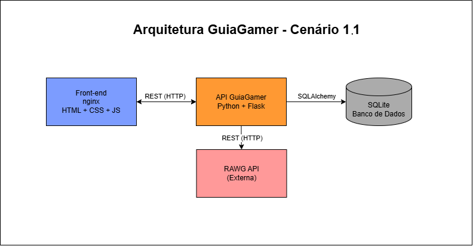

# GuiaGamer - API (Back-end)

API REST do projeto **GuiaGamer**, um app web que oferece detonados de jogos com sistema de pistas progressivas para evitar spoilers indesejados.

Esta é a parte do back-end do projeto. O front-end está em outro repositório.

## Sobre o projeto

O GuiaGamer nasceu pra resolver alguns problemas comuns dos gamers ao consultar detonados online:

- Exposição a spoilers de partes do jogo que o jogador ainda não chegou
- Dificuldade de lembrar exatamente onde parou no detonado
- Necessidade de consultar diferentes sites dependendo do jogo

Para evitar spoilers, o app oferece um sistema de pistas em 3 níveis:

- **Dica leve**: uma sugestão sutil, sem entregar a resposta
- **Dica direta**: orientação mais clara
- **Passo completo**: a resposta detalhada

Assim, o jogador escolhe quanto quer revelar a cada momento.

Além disso, o app permite marcar etapas como concluídas, ajudando o jogador a acompanhar seu progresso e retomar de onde parou.

No futuro, a ideia é que o site funcione como um "wikipedia" em que temos um sistema de login e que os usuários podem cadastrar os jogos e detonados e fazerem sugestões de ajustes quando preferirem.

## Arquitetura

O projeto segue o Cenário 1.1 da proposta do MVP, com três componentes se comunicando:

- **Front-end** (nginx): interface web em HTML, CSS e JavaScript
- **API GuiaGamer** (este repositório): API REST em Python com Flask, se comunica com o SQLite e com a API externa
- **RAWG API** (externa): base de dados de jogos usada para enriquecer os cadastros

## Tecnologias usadas

- Python 3.11
- Flask
- Flask-SQLAlchemy
- Flask-CORS
- Flasgger
- SQLite
- Requests (para consumir a API externa)
- python-dotenv (para variáveis de ambiente)
- Docker

## Como instalar e rodar

### Pré-requisitos

- Python 3.11 ou superior

### Passo a passo

1. Clonar o repositório: `git clone https://github.com/fredericwithc/guiagamer-be.git` e depois `cd guiagamer-be`

2. Criar o ambiente virtual: `python -m venv venv`

3. Ativar o ambiente virtual: `venv\Scripts\activate`

4. Instalar as dependências: `pip install -r requirements.txt`

5. Configurar a chave da RAWG (veja a seção "API Externa" abaixo)

6. Rodar o servidor: `python app.py`

A API vai estar rodando em `http://localhost:5000`

## Documentação da API

Com o servidor rodando, você pode acessar `http://localhost:5000/apidocs` pra ver a documentação completa no Swagger.

## Rotas disponíveis

### Jogos

- `GET /listar_jogos` - lista todos os jogos
- `POST /cadastrar_jogo` - cadastra um novo jogo
- `GET /buscar_jogo/<id>` - busca um jogo pelo id
- `PUT /atualizar_jogo/<id>` - atualiza um jogo existente
- `DELETE /deletar_jogo/<id>` - deleta um jogo

### Etapas

- `POST /cadastrar_etapa` - cadastra uma nova etapa
- `GET /listar_etapas/<jogo_id>` - lista as etapas de um jogo
- `PUT /atualizar_etapa/<id>` - atualiza uma etapa existente
- `DELETE /deletar_etapa/<id>` - deleta uma etapa

### API Externa

- `GET /buscar_jogo_externo?nome=<nome>` - busca dados de um jogo na RAWG

## Banco de dados

O banco tem duas tabelas com relacionamento 1:N (um jogo tem várias etapas):

**Tabela jogos:**

- id (chave primária)
- nome
- plataforma
- descricao
- imagem_url

**Tabela etapas:**

- id (chave primária)
- jogo_id (chave estrangeira)
- numero
- titulo
- pista_leve
- pista_media
- resposta_completa

Obs: Quando um jogo é deletado, todas as suas etapas são deletadas automaticamente.

## API Externa

Este projeto consome a RAWG Video Games Database API para enriquecer o cadastro de jogos com dados como capa, notas, gêneros, plataformas e data de lançamento.

### Sobre a RAWG

A RAWG é uma das maiores bases de dados de videogames do mundo, com mais de 500 mil jogos catalogados. A API é gratuita para uso pessoal e de aprendizado.

### Como configurar

Para usar a integração com a RAWG, você precisa:

1. Criar uma conta gratuita em rawg.io
2. Acessar rawg.io/apidocs para pegar sua API Key
3. Criar um arquivo `.env` na raiz do projeto com o seguinte conteúdo (substituindo pela sua chave): `RAWG_API_KEY=sua_chave_aqui`

### Rota que consome a API externa

A rota `GET /buscar_jogo_externo?nome=<nome>` faz chamada para o endpoint oficial da RAWG (`https://api.rawg.io/api/games`) enviando a chave e o nome do jogo, e retorna dados filtrados como nome, imagem, data de lançamento, nota, plataformas e gêneros.

### Licença de uso

A RAWG API é gratuita para uso pessoal, educacional e não-comercial. Para uso comercial ou volumes maiores, consulte os termos de uso oficiais em rawg.io/apidocs.

## Como rodar com Docker

O projeto tem um Dockerfile pronto para rodar em containers.

### Pré-requisitos

- Docker Desktop instalado e rodando

### Passo a passo

1. Clonar o repositório (se ainda não clonou): `git clone https://github.com/fredericwithc/guiagamer-be.git` e depois `cd guiagamer-be`

2. Fazer o build da imagem: `docker build -t guiagamer-be .`

3. Rodar o container (substituindo pela sua chave da RAWG): `docker run -d -p 5000:5000 -e RAWG_API_KEY=sua_chave_aqui --name guiagamer-back guiagamer-be`

4. Acessar a API em `http://localhost:5000` ou a documentação em `http://localhost:5000/apidocs`

### Comandos úteis

- Ver logs: `docker logs guiagamer-back`
- Parar o container: `docker stop guiagamer-back`
- Iniciar de novo: `docker start guiagamer-back`
- Remover o container: `docker rm guiagamer-back`

## Front-end

O front-end do projeto está em outro repositório: https://github.com/fredericwithc/guiagamer-fe

## Feito por

Frederic Chomé Bombini Leyenberger - Projeto de MVP da pós-graduação da PUC-Rio